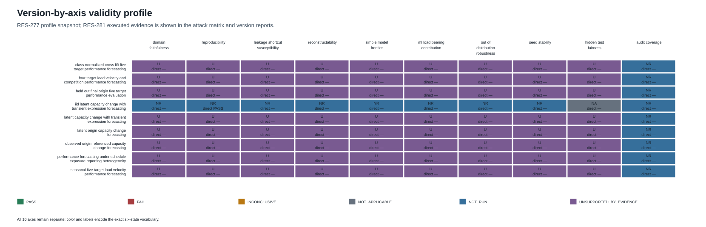
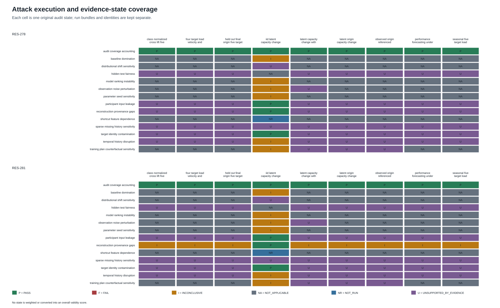
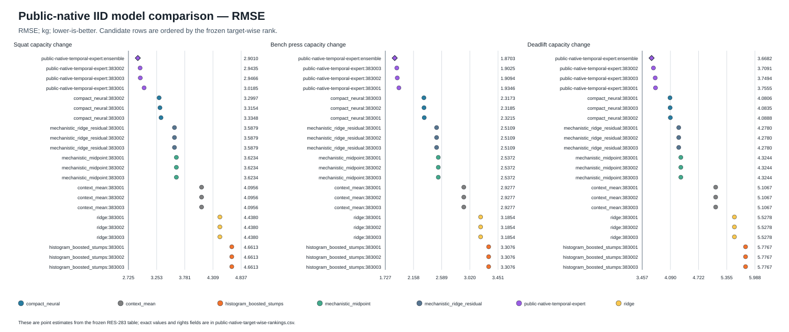
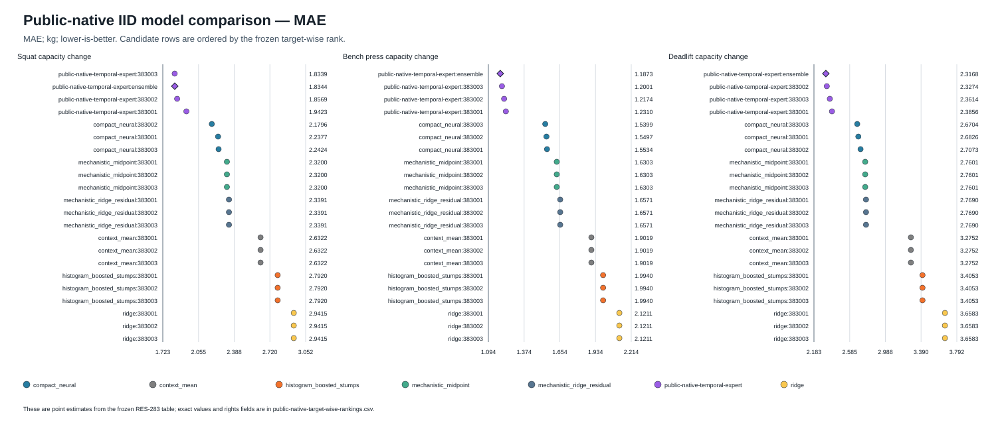
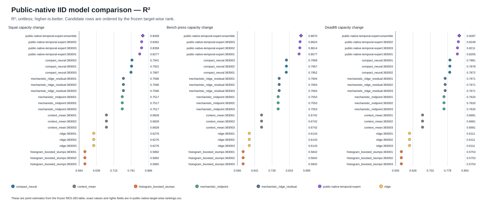
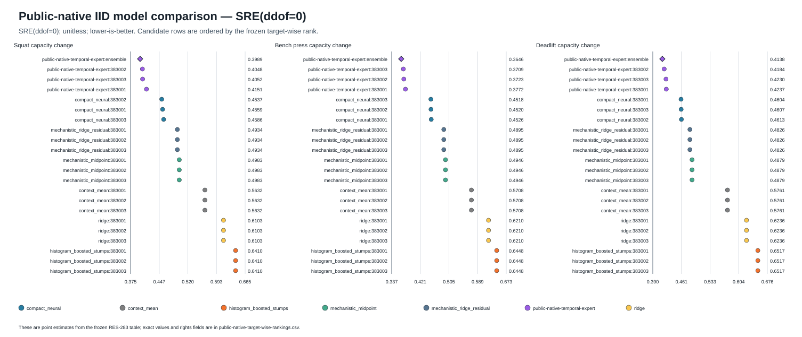
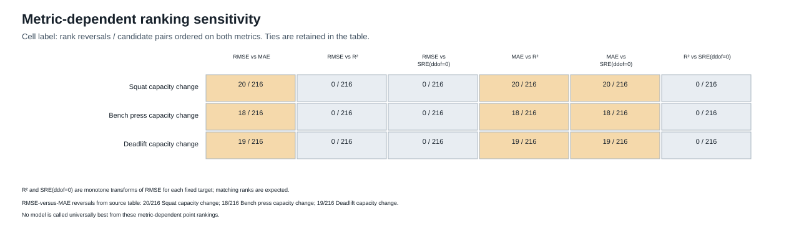
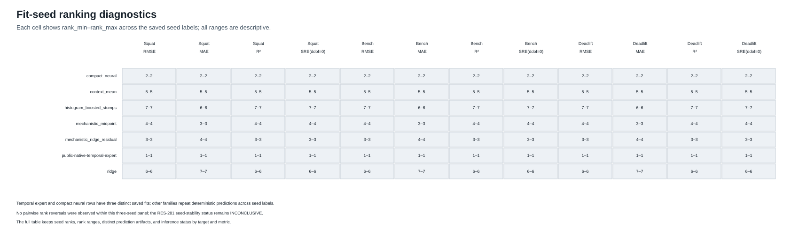
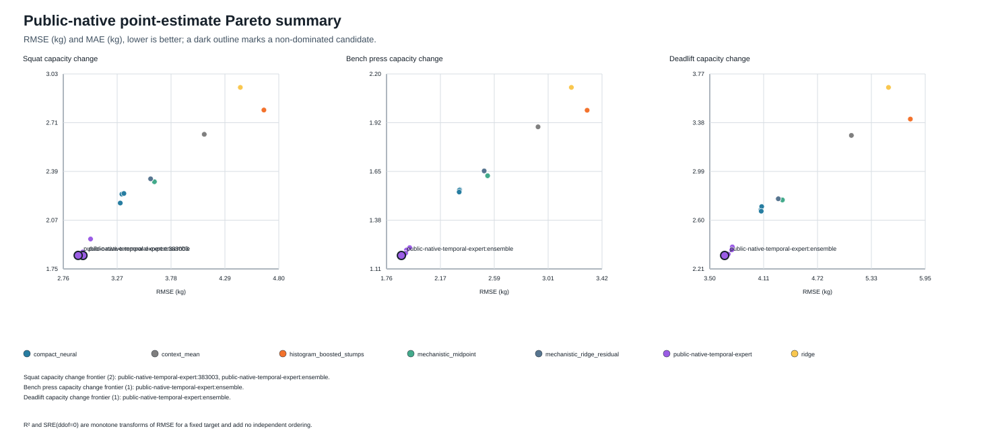
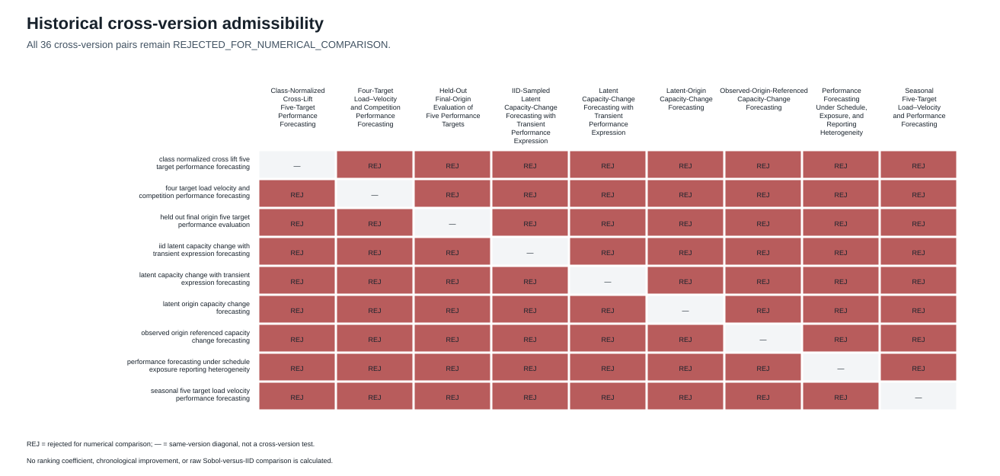

# Benchmark validity and historical ranking sensitivity

RES-284 research-facing synthesis. All result states and scientific identities are inherited from the frozen RES-277/278/281/283 artifacts.

## Findings in brief

- The audit suite describes coverage across nine benchmark versions and ten validity axes. It does not produce a universal validity score.
- One model panel is admissible for target-wise comparison: the public-native IID realization, seven families, 22 candidate fitted-instance/ensemble identities, three targets, and 3,072 shared prediction keys.
- The temporal-expert ensemble leads 11/12 target-metric point-estimate comparisons. Squat MAE is led by temporal-expert seed 383003. These are descriptive point rankings, without statistical-significance or practical-superiority claims.
- The saved three-seed panel has no observed fit-seed ranking reversal. This does not establish stability outside that panel; deterministic seed repeats are not independent fit replications.
- Paired uncertainty remains unidentified because tracked validation target truth and row-to-entity mappings are absent. All 264 uncertainty cells remain UNSUPPORTED_BY_EVIDENCE with inference INCONCLUSIVE.
- All 36 historical cross-version numerical comparisons remain rejected. Eight historical versions lack public matched fitted-model/evaluation panels, so their rankings are not identifiable.

## Scope and identities

Public-native BenchmarkSpec: psr:benchmark-spec:iid-latent-capacity-change-with-transient-expression-forecasting@1.0.0~f99463d55ba0
DatasetRealization: psr:dataset-realization:latent-capacity-transient-iid-production@sha256:2659bad8979e5a00829a50580c14bfbc90579c4520c46c8159dec8c34f1c8cad
Evaluation: psr:evaluation:iid-latent-capacity-change-four-metric-validation@1.0.0~cd4fe982e7b8
RES-283 analysis identity: psr:analysis:res283-public-native-model-ranking-stability-v1@sha256:313e781f2a7454c1e9068c9de7982f63cd088ea52db1c8d687f1c2016f44a010
RES-283 source commit: 2a054dde5042293b2cb096a528442c9f25f28ae4

The report uses saved EvaluationResult metrics and ranking diagnostics. It does not train models, generate datasets, regenerate predictions, execute new audit attacks, rescore predictions, or bootstrap uncertainty.

## Version validity profiles

- [Class-Normalized Cross-Lift Five-Target Performance Forecasting](profiles/class_normalized_cross_lift_five_target_performance_forecasting.md)
- [Four-Target Load–Velocity and Competition Performance Forecasting](profiles/four_target_load_velocity_and_competition_performance_forecasting.md)
- [Held-Out Final-Origin Evaluation of Five Performance Targets](profiles/held_out_final_origin_five_target_performance_evaluation.md)
- [IID-Sampled Latent Capacity-Change Forecasting with Transient Performance Expression](profiles/iid_latent_capacity_change_with_transient_expression_forecasting.md)
- [Latent Capacity-Change Forecasting with Transient Performance Expression](profiles/latent_capacity_change_with_transient_expression_forecasting.md)
- [Latent-Origin Capacity-Change Forecasting](profiles/latent_origin_capacity_change_forecasting.md)
- [Observed-Origin-Referenced Capacity-Change Forecasting](profiles/observed_origin_referenced_capacity_change_forecasting.md)
- [Performance Forecasting Under Schedule, Exposure, and Reporting Heterogeneity](profiles/performance_forecasting_under_schedule_exposure_reporting_heterogeneity.md)
- [Seasonal Five-Target Load–Velocity and Performance Forecasting](profiles/seasonal_five_target_load_velocity_performance_forecasting.md)

The RES-277 profile snapshot remains distinct from the RES-278 and RES-281 execution outcomes. Figure 1 colors the original RES-277 state and labels a direct RES-281 axis state separately where available; audit coverage is process metadata, not established validity.

Figure 1. Color and the first cell label show the RES-277 profile state; a second label shows the direct RES-281 axis state where available. Attack states are shown in Figure 2. No values are combined into a validity score.

### Audit execution and evidence states

| Execution | Records | PASS | FAIL | INCONCLUSIVE | NOT_APPLICABLE | NOT_RUN | UNSUPPORTED_BY_EVIDENCE |
| --- | ---: | ---: | ---: | ---: | ---: | ---: | ---: |
| RES-278 | 126 | 12 | 0 | 6 | 53 | 1 | 54 |
| RES-281 | 126 | 12 | 0 | 14 | 53 | 1 | 46 |

Figure 2. Separate attack-by-version matrices for RES-278 and RES-281. Every cell retains its exact audit state. Full records, diagnostics, limitations, evidence references, and source identities are in tables/attack-evidence-states.csv.

RES-281 public-native participant-key relabeling and target-canary tests each produced zero prediction mismatches and zero maximum absolute prediction delta across 96 audit rows and 18 registered fitted comparator states. The PASS scope is the repository inference adapter, not external participant models.

## Reproducibility

The RES-281 direct reproducibility receipt is PASS for the public-native IID realization: two complete generations produced byte-identical train and validation files, and both manifests matched the frozen manifest. This verifies that IID realization only; it does not reconstruct the historical scrambled-Sobol bytes. Historical versions retain their separate RES-277 reproducibility profile states and RES-278/281 provenance-review states in each profile.

## Public-native IID model comparison

The complete seven-family, 22-candidate target-wise table retains every exact saved RMSE, MAE, R², SRE(ddof=0), and rank value, with the original source-rights field by model family. Metric identities, units, and preferred directions are listed in tables/metric-definitions.csv: RMSE and MAE are kilograms; R² and SRE(ddof=0) are unitless; RMSE, MAE, and SRE minimize; R² maximizes.

| Target | Metric | Rank-1 candidate | Point estimate | Unit |
| --- | --- | --- | ---: | --- |
| Squat capacity change | RMSE | public-native-temporal-expert:ensemble | 2.9009557745782533 | kg |
| Squat capacity change | MAE | public-native-temporal-expert:383003 | 1.8338806628876931 | kg |
| Squat capacity change | R² | public-native-temporal-expert:ensemble | 0.8408747232546605 | unitless |
| Squat capacity change | SRE(ddof=0) | public-native-temporal-expert:ensemble | 0.3989050974170919 | unitless |
| Bench press capacity change | RMSE | public-native-temporal-expert:ensemble | 1.8702871931828533 | kg |
| Bench press capacity change | MAE | public-native-temporal-expert:ensemble | 1.187341252597957 | kg |
| Bench press capacity change | R² | public-native-temporal-expert:ensemble | 0.8670488270300638 | unitless |
| Bench press capacity change | SRE(ddof=0) | public-native-temporal-expert:ensemble | 0.3646247015356147 | unitless |
| Deadlift capacity change | RMSE | public-native-temporal-expert:ensemble | 3.6681919557104026 | kg |
| Deadlift capacity change | MAE | public-native-temporal-expert:ensemble | 2.31680470523922 | kg |
| Deadlift capacity change | R² | public-native-temporal-expert:ensemble | 0.8287390369162662 | unitless |
| Deadlift capacity change | SRE(ddof=0) | public-native-temporal-expert:ensemble | 0.41383687980137035 | unitless |

| Metric | Figure |
| --- | --- |
| RMSE |  |
| MAE |  |
| R² |  |
| SRE(ddof=0) |  |

Figure 3a–d. Frozen target-wise point estimates, faceted by squat, bench press, and deadlift. The figures show no uncertainty intervals; exact source values and candidate identities are in tables/public-native-target-wise-rankings.csv.

### Metric-dependent rankings

RMSE-versus-MAE rankings reverse for 20 of 216 ordered candidate pairs on squat, 18/216 on bench press, and 19/216 on deadlift (15 ties per metric in each target panel). R² and SRE(ddof=0) share the RMSE ordering for each fixed target because they are monotone transforms of RMSE on that evaluation population.

Figure 4. Exact pairwise reversal counts from the saved metric sensitivity table. Reversals are descriptive and do not establish a universal best model.

### Fit-seed diagnostics

No pairwise ranking reversal was observed across the saved three-seed panel for any target/metric. The temporal-expert and compact-neural seeds are distinct fits; context mean, Ridge, boosted stumps, mechanistic midpoint, and mechanistic-plus-Ridge residual entries repeat deterministic predictions across seed labels. Dataset-seed, split-seed, and distribution-shift stability were not estimated. RES-281 model-ranking-instability remains INCONCLUSIVE.

Figure 5. Each cell gives the observed rank range across the saved fit-seed labels. A zero range in a deterministic-repeat family is not independent replication evidence.

### Descriptive Pareto frontiers

The exact point-estimate frontier has two squat candidates (expert seed 383003 and the expert ensemble), one bench-press candidate (ensemble), and one deadlift candidate (ensemble). R² and SRE add no independent ordering beyond RMSE for a fixed target. The frontier is descriptive; RES-281 baseline-domination remains INCONCLUSIVE without a practical margin or paired uncertainty method.

Figure 6. Point estimates for the 22 candidate identities by target; outlined points lie on the exact descriptive frontier. No uncertainty is shown.

### Named plan, history, and observation diagnostics

RES-281 recorded 96 audit rows and 18 fitted comparator states for each of these interventions. The plan counterfactual, reversed-history, and three-replicate observation-noise outcomes remain INCONCLUSIVE. Their complete recorded scalar diagnostics are in tables/public-native-stress-diagnostics.csv; no real-athlete effect or broad robustness conclusion is drawn.

## Historical cross-version sensitivity

The RES-281 comparability decisions are binding: all 36 cross-version pairs remain REJECTED_FOR_NUMERICAL_COMPARISON. Eight historical versions lack rights-cleared public rows, matched fitted-model/prediction panels, and common-evaluation results. Their within-version rankings and cross-version ranking stability are therefore not identifiable. This missing evidence does not show either stability or instability.

Figure 7. All off-diagonal version pairs are rejected for numerical comparison; the diagonal is not a cross-version test.

The genealogy table records design differences descriptively. Benchmark chronology does not establish validity improvement, and no design change is assigned a causal effect. Different designs could alter model rankings in principle, but no observed cross-version ranking effect is supported here. Scrambled-Sobol historical scores and public-native IID scores are not directly ranked, and no cross-version coefficient or improvement statistic is calculated.

## Evidence-to-claim traceability

Every published claim has a row in tables/evidence-to-claim.csv with its evidence class, exact source paths, and interpretation boundary. Output figure/table source hashes are recorded per artifact in checksum-index.json.

## Rights and provenance

The source prediction-rights field for public-native temporal expert remains NOASSERTION as recorded in the RES-283 evidence table. The publication includes aggregate EvaluationResult metadata and does not copy source prediction JSONL or checkpoint files. Private historical rows, checkpoints, and outputs remain outside this bundle. Repository presence alone is not treated as permission.

RES-278 and RES-281 bundle and checksum verification passed; the RES-281 bundle SHA-256 matches the handoff value. The RES-281 analysis source index and RES-283 output checksum index were verified. The input/output hashes and scientific source identities are in checksum-index.json.

## Reproduction and companion tables

Regenerate the publication from the repository root with: uv run --locked python -m powerlifting_state_research.audits.res284_publication
Check deterministic report, table, and figure replay with: uv run --locked python -m powerlifting_state_research.audits.res284_publication --check

| Artifact | Contents |
| --- | --- |
| tables/version-by-axis-evidence.csv | RES-277 baseline states plus RES-281 direct axis evidence |
| tables/attack-evidence-states.csv | Both 126-record RES-278 and RES-281 attack ledgers, including exact identities and diagnostics |
| tables/attack-by-version-res281.csv | RES-281 attack-by-version state matrix |
| tables/public-native-target-wise-rankings.csv | Exact target-wise metrics and ranks for all 22 candidates |
| tables/metric-definitions.csv | Frozen metric identities, units, and directions |
| tables/metric-ranking-sensitivity.csv | Reversal and tie counts by metric pair and target |
| tables/fit-seed-rank-stability.csv and fit-seed-pairwise-reversals.csv | Per-seed ranks and reversal diagnostics |
| tables/pareto-comparison-summary.csv | Exact point-estimate frontier membership |
| tables/paired-uncertainty-evidence.csv | All unsupported uncertainty cells and their limits |
| tables/historical-comparability.csv | All 36 rejected cross-version pairs |
| tables/benchmark-genealogy.csv | Historical specimen identity and descriptive design changes |
| tables/evidence-to-claim.csv | Claim/source/limitation traceability |
| tables/scientific-limitations.csv | Evidence gaps and future evidence requirements |
| tables/rights-provenance.csv | Model family rights constraints; NOASSERTION retained |
| tables/public-native-stress-diagnostics.csv | Existing plan/history/noise diagnostic values only |

## References

Frozen metric and ranking sources: results/audits/res283-analysis/run-manifest.json, results/audits/res283-analysis/checksum-index.json, and the per-target RES-283 analysis CSVs.
RES-277 axis and attack contracts: docs/audits/index.md and artifacts/registries/validity-axis-registry.json / attack-contract-registry.json.
RES-281 report and evidence: results/audits/res281-analysis/res281-validity-analysis.md.
RES-283 report and limitations: results/audits/res283-analysis/res283-model-ranking-stability.md and RES-284-handoff.md.
