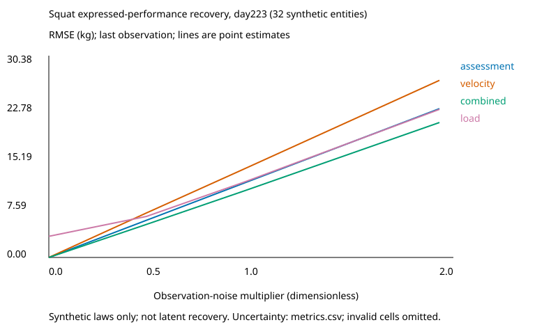
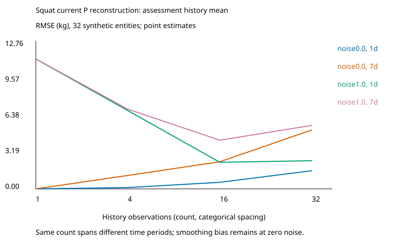

# Observation inversion and latent-state observability

Study `psr:study:observation-inversion-public-native@1.0.0~906ce39f2a2c`; protocol `sha256:906ce39f2a2ca296b35fa2ea97d5ca1eed033bb3b675f9da186aafc434dfdda9`. Independent synthetic experiment, not recovered G1 measurements. [Manifest](manifest.json) binds every input, source and output SHA-256. The [frozen protocol](../../../studies/observation_inversion/protocol.json), [formal derivation](../../../studies/observation_inversion/formal-specification.md) and [historical lineage](../../../studies/observation_inversion/historical-lineage.md) specify assumptions and evidence classes.

## Historical evidence

G1 research-home/name and attachment survive as metadata. Exact original question, G1 measurements, estimators, experiments, fitted models and numerical results are unavailable. Parent benchmark equations and channel semantics survive as public projections; they cannot be relabelled G1 experiments. Historical numerical claims remain UNSUPPORTED_BY_EVIDENCE. No private artifacts are read. All executed numbers below are NEW_PUBLIC_NATIVE_EXPERIMENT.

## Methods and independent realization

32 independently sampled entities; three lifts; four balanced native history templates per lift; future continue plan. No fitting or selection: all entities form a separately hashed evaluation-only split. Truth and base observations are stored separately as truth.jsonl and observations.jsonl. Native observation draws are reused across noise scales, with the load recomputed from the same fraction of scaled assessment. Noise changes no latent truth. Cadences 1/7 days and lengths 1/4/16/32 all end at223; equal lengths span different time intervals. Estimators use analytical inverse, last observation or mean. Load-only uses its known fraction midpoint. Combined uses a plug-in delta-method variance rule, which is approximate and not a physiological estimator or Bayes optimum.

Targets are current expressed P223, current latent C223 and future expressed P230, all kg. Persistence/mean prediction of P230 is distinct from the frozen canonical DeltaC benchmark; no canonical model comparisons or scores are changed. RMSE, MAE and signed bias are per lift/target. Point estimates and 95% percentile bootstrap intervals describe this finite synthetic population; paired intervals in comparisons.csv assess combined-minus-assessment differences. No multiple-testing or universal superiority claim is made. Invalid inverses invalidate the entire cell; no row is silently removed. Raw entity errors permit independent metric checks.

## Quantitative channel comparison

Native noise, one most recent observation; exact full-precision values and all ablations appear in [metrics.csv](metrics.csv). Each row has its condition and status; [comparisons.csv](comparisons.csv) retains paired uncertainty and negative/inconclusive findings.

| Lift | Channel | Target | RMSE kg | 95% entity bootstrap kg | Status |
|---|---|---|---:|---|---|
| squat | assessment | P223_kg | 11.602030 | [8.592322, 14.410807] | COMPLETE |
| squat | assessment | C223_kg | 16.305410 | [11.899984, 20.435325] | COMPLETE |
| squat | assessment | P230_kg | 10.838361 | [8.302085, 13.173643] | COMPLETE |
| squat | velocity | P223_kg | 13.801676 | [9.302703, 18.051447] | COMPLETE |
| squat | velocity | C223_kg | 17.727717 | [11.724527, 23.341634] | COMPLETE |
| squat | velocity | P230_kg | 13.463128 | [9.705398, 16.912419] | COMPLETE |
| squat | combined | P223_kg | 10.375318 | [6.158768, 13.976285] | COMPLETE |
| squat | combined | C223_kg | 15.846876 | [10.874793, 20.553568] | COMPLETE |
| squat | combined | P230_kg | 9.484365 | [6.617415, 12.262005] | COMPLETE |
| squat | load | P223_kg | 11.750486 | [8.025187, 15.270907] | COMPLETE |
| squat | load | C223_kg | 16.454953 | [11.822848, 21.056240] | COMPLETE |
| squat | load | P230_kg | 10.951486 | [7.672358, 13.947505] | COMPLETE |
| bench_press | assessment | P223_kg | 5.218541 | [3.922785, 6.552661] | COMPLETE |
| bench_press | assessment | C223_kg | 7.602745 | [5.918331, 9.155534] | COMPLETE |
| bench_press | assessment | P230_kg | 5.283390 | [4.089537, 6.663262] | COMPLETE |
| bench_press | velocity | P223_kg | 6.454760 | [4.750660, 8.001708] | COMPLETE |
| bench_press | velocity | C223_kg | 9.702963 | [7.206773, 12.220025] | COMPLETE |
| bench_press | velocity | P230_kg | 6.715490 | [5.035983, 8.138016] | COMPLETE |
| bench_press | combined | P223_kg | 4.210690 | [2.914663, 5.394438] | COMPLETE |
| bench_press | combined | C223_kg | 8.072543 | [6.275916, 10.014945] | COMPLETE |
| bench_press | combined | P230_kg | 4.351157 | [3.117744, 5.403443] | COMPLETE |
| bench_press | load | P223_kg | 5.914591 | [4.143195, 8.029255] | COMPLETE |
| bench_press | load | C223_kg | 8.277082 | [6.593585, 9.772654] | COMPLETE |
| bench_press | load | P230_kg | 5.765155 | [3.906739, 7.984591] | COMPLETE |
| deadlift | assessment | P223_kg | 17.299619 | [11.853056, 23.209816] | COMPLETE |
| deadlift | assessment | C223_kg | 18.064088 | [13.093320, 23.071287] | COMPLETE |
| deadlift | assessment | P230_kg | 17.274363 | [11.875618, 22.713914] | COMPLETE |
| deadlift | velocity | P223_kg | 34.588645 | [17.391068, 51.672418] | COMPLETE |
| deadlift | velocity | C223_kg | 35.255171 | [20.044942, 50.746135] | COMPLETE |
| deadlift | velocity | P230_kg | 34.766601 | [17.689783, 51.865479] | COMPLETE |
| deadlift | combined | P223_kg | 12.034662 | [8.614239, 15.174673] | COMPLETE |
| deadlift | combined | C223_kg | 15.586693 | [12.098555, 18.996303] | COMPLETE |
| deadlift | combined | P230_kg | 11.755769 | [8.524329, 14.644733] | COMPLETE |
| deadlift | load | P223_kg | 17.303373 | [11.850648, 22.660034] | COMPLETE |
| deadlift | load | C223_kg | 17.687571 | [12.985324, 22.227695] | COMPLETE |
| deadlift | load | P230_kg | 17.413422 | [11.936675, 22.669279] | COMPLETE |

The plots read these table cells directly. It depicts P recovery, not latent observability. [metrics.csv](metrics.csv) also contains history/cadence and C/P230 sensitivity, including smoothing bias and invalid counts. Per-condition evidence must be used rather than a single aggregate score.

A concrete negative result: with noiseless squat assessments, the last observation has zero P223 error but the 32-week history mean has RMSE 5.263390 kg (metrics.csv: squat, noise0, cadence7, length32, mean, P223). The same noiseless last-observation reconstruction has C223 RMSE 8.355256 kg, directly separating P recovery from capacity recovery. Native-noise squat P223 RMSE is 11.602030 kg for assessment and 10.375318 kg for combined, but the paired difference interval [-3.655584, 0.800929] kg includes zero (comparisons.csv: squat, noise1, length1, cadence7, last, P223). Deadlift's same-condition interval excludes zero, while bench press's does not. These support condition-specific conclusions only. Across all predeclared comparisons, 86 PASS, 40 FAIL and 450 INCONCLUSIVE cells are retained; duplicated last/mean and cadence conditions are not independent experiments.

## Mathematical findings and authority boundaries

Noiseless last-observation assessment, velocity with measured load, and combined inversion recover P within 1e-10 kg on every entity/lift. This is hypothesis H1, checked during execution. C is not generally equal to P, so even exact P recovery is not capacity recovery (H3; zero-noise C cells in metrics.csv). A single-time channel Jacobian factors through P and has latent rank at most one (H2; formal derivation and diagnostics.json instantaneous).

The constructive same-P example has C1=221.988202471 kg and C2=225.807354342 kg, with different admissible (A,R). It is a single-time free-state counterexample; it is not proof that native whole histories admit those states. Under a separate free-initial-state rest extension with known parameters, two-time Jacobians have the ranks/conditioning and derivative checks in [diagnostics.json](diagnostics.json). Native initial states are fixed zero; knowing parameters and inputs permits forward simulation, which is privileged knowledge rather than observation-based inference.

Midpoint six-coordinate Jacobians for four native templates have ranks and singular spectra in diagnostics.json. These are generator-authority local numerical sensitivity diagnostics with central-difference refinement, not global inverse proofs or participant recovery. Constant-continue histories admit an exact reference-stimulus parameter and hidden-state ambiguity, with maximum P discrepancy 5.68e-14 kg. This controlled input is within dose support but outside the four native templates. The native near-equivalence perturbation changes reference coordinate by 0.01 and yields P-history RMSE 0.019805723 kg; this measures weak practical sensitivity, not exact equivalence.

## Negative results and unresolved claims

[claims.csv](claims.csv) preserves negative results and missing-evidence semantics. Exact expressed-performance inversion is insufficient for C/A/R recovery. Full local numerical rank is insufficient for global identification. Long-history means can mix changing states; their errors cannot be interpreted as pure observation-noise effects. Correlated load prescription makes velocity-only a load-plus-velocity information set, and load alone already contains assessment information. H4 remains condition-specific PASS/FAIL/INCONCLUSIVE in paired comparisons; uncertainty spanning zero is not positive evidence. Zero-noise differences within the declared 1e-10 kg inverse tolerance are numerical equivalence: raw interval-sign PASS/FAIL labels in those cells are not scientific superiority evidence. Physiology, causal effects, real-athlete validation, unknown-model discovery and native-template global identification remain unsupported or unresolved.

## Rights, reproduction and limits

New code and generated numeric artifacts are MIT; authored prose CC BY 4.0. All source hashes and origin decisions are in manifest.json and the public origin ledger. Historical provenance confers no artifact rights. RES-284 missing matched historical panels and uncertainty restrictions remain unchanged. This study has its own truth, so its entity bootstrap is supported independently. Small synthetic sample, one population realization and one noise realization do not establish robustness across seeds or distributions.

Run `uv run --locked python -m powerlifting_state_research.studies.observation_inversion --check` for full deterministic replay, hashes, source/protocol freeze and M0–M5 preservation. [RES-289 handoff](RES-289-handoff.md) lists evidence requirements only; RES-289 is not executed.
